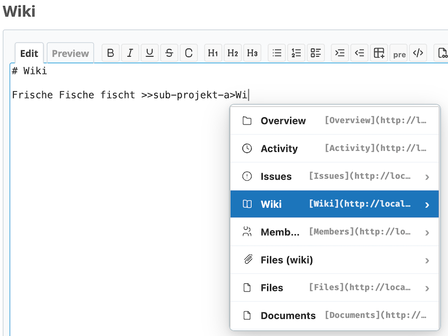

# Redmine Subsuggest Plugin


A Redmine plugin that enables quick access to Redmine objects and macros via trigger characters, contextual autocomplete, and an inline selection menu in any text field.

Typing trigger characters `>>`, `{{` or `@` opens an inline context menu with relevant suggestions (objects, macros, users). To edit simply click into the item again and press `Tab`. This reopens the respective autocomplete dropdown:



## Requirements

- Redmine 4.0 or higher

## Installation

> [!IMPORTANT]
> The plugin directory must be named exactly `redmine_subsuggest` for the hook to load correctly.

1. **Clone** into your plugins directory:

   ```bash
   cd /path/to/redmine/plugins
   git clone https://github.com/subversive-tools/redmine_subsuggest.git redmine_subsuggest
   ```

2. **Restart Redmine** (no migrations required).

## Features & Usage

All features work in **every wiki text area**: wiki pages, issue descriptions, issue notes, journal edits, news comments, forum messages, and project/document descriptions.

### `>>` — Smart Linker

Type `>>` after a space or at the start of a line. A compact multi-column panel opens, showing one active navigation column at a time and following your cursor.

You can either navigate options visually (using arrow keys or your mouse cursor) or type text to filter options in real-time and press `Tab`/`Enter` to autocomplete and drill down.

- **Hierarchical Drill-Down**: Seamlessly drill down from projects/subprojects $\rightarrow$ sections (Issues, Wiki, News, Files, etc.) $\rightarrow$ target items or wiki anchors.
- **Keyboard Shortcuts**:
  - **ArrowUp / ArrowDown**: Navigate through list items in the active column.
  - **Tab / Enter / ArrowRight (`→`)**: Expand the highlighted intermediate item (project or subpage branch), appending a `>` delimiter (e.g. `>>myproject>Tickets>`) and cascading to the next adjacent column.
  - **Escape (`Esc`) / ArrowLeft (`←`) / Shift+Tab**: Backtrack one column level to the left, safely reverting the path and restoring the highlighted parent selection without closing the panel.
- **Wiki Anchors, News, Documents & Files**:
  - **Wiki Anchors**: Typing `#` after a Wiki page name or highlighting a page in Column 3 and pressing `Tab` triggers autocomplete for the page's headings.
  - **News, Documents, Files etc.**: Integrates project news (with comment counts), documents (crawled dynamically), and files (via JSON API) for instant lookup and linking.
- **Dynamic Third-Party Addons**: The Smart Linker dynamically crawls the `#main-menu` navigation on load. Any third-party Redmine addon tab (e.g., DMSF, Questions, Checklists, etc.) will automatically appear as an option in the subpage list and can be searched and linked directly.

### `{{` — Macro Autocomplete

Type `{{` anywhere in a wiki text area. A dropdown appears listing all available macros with a short description. Use arrow keys to navigate, `Tab` or `Enter` to insert.

The detail panel below the list shows the full macro description for the currently selected entry.

### `@` — Instant Mention

Type `@` at the start of a word. The member dropdown opens immediately (unlike Redmine's default which requires at least one character). Results are capped at the first 10 members for performance.

## Configuration

Administrators can configure the plugin under **Administration -> Plugins -> Subsuggest (Configure)**:

- **Toggle Features**: Independently enable/disable macro autocomplete (`{{`), mention autocomplete patch (`@`), or the Smart Linker (`>>`).
- **Custom Trigger**: Customize the trigger characters for the Smart Linker (default is `>>`, but can be set to any other key).

## How It Works

The plugin injects a single `<style>` and `<script>` block into every Redmine page via a `ViewListener` hook. No external dependencies or bloated JavaScript frameworks. All assets are read from disk on each request, making browser reload sufficient after updating plugin files.

The project list is prefetched 2 seconds after page load so the Smart Linker panel opens instantly.

## Contributing

Contributions are welcome — please fork the repository and open a Pull Request.

1. Fork it
2. Create your feature branch (`git checkout -b feature/my-feature`)
3. Commit your changes
4. Push to the branch
5. Open a Pull Request

## License

[MIT License](LICENSE) — Copyright (c) 2026 Stefan Mischke
